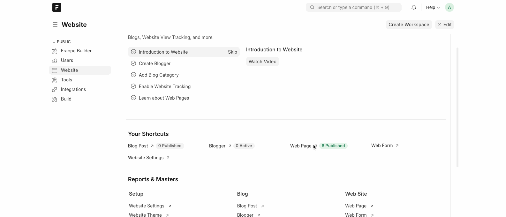

# fossunited-desk-pages
The source code dump of the webpages in desk of [fossunited.org]('https://fossunited.org')

---

Some of our static web pages are directly written in the desk of FOSS United Platform, and without desk access, it is not possible to access the source code of these pages. 

Hence, we are opening the source code of those pages via this repo. 

### Working with FOSS United Platform

1. To view these web pages within our platform app, follow these [steps](https://github.com/fossunited/fossunited#installation) to install the project in your local system. 

2. Create a new webpage in the desk view and add the code in the provided relevant fields. 

### Important to note: 

- Most of the values are fetched from relevant doctypes that are present in the platform. 

- This should only serve as a reference for the site structure and styles.